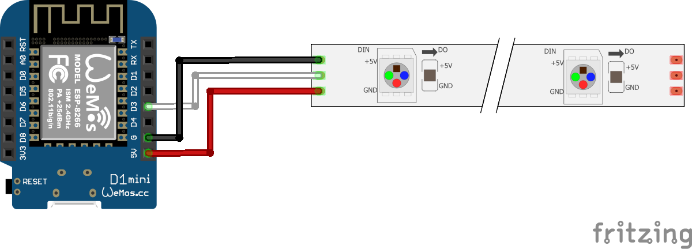
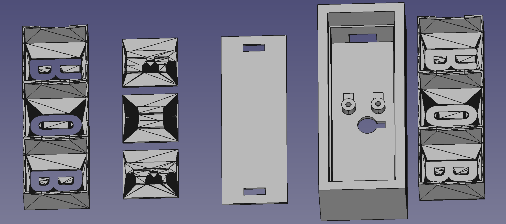
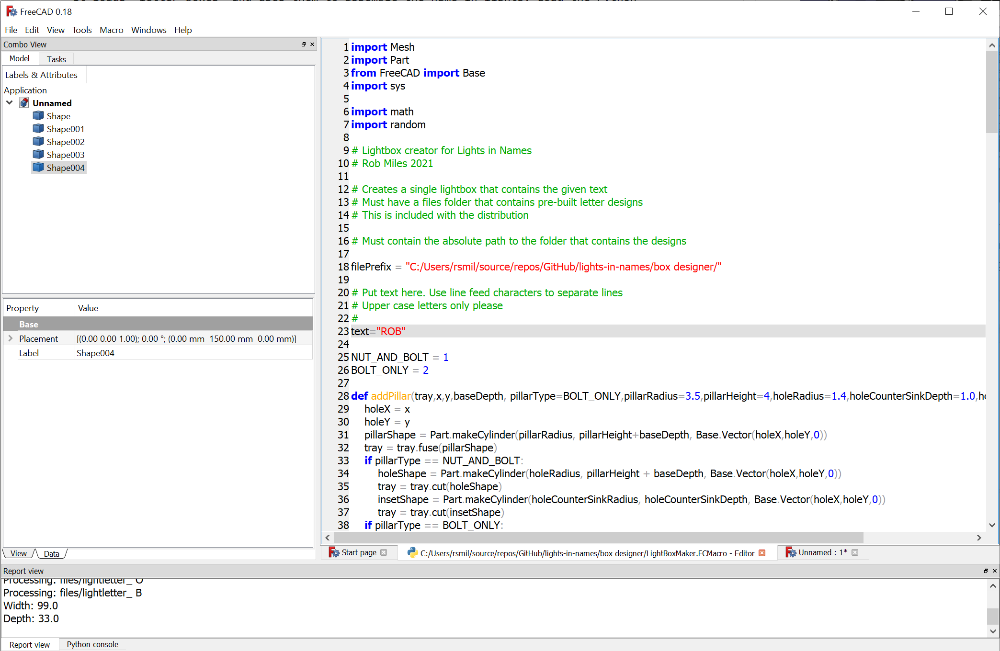
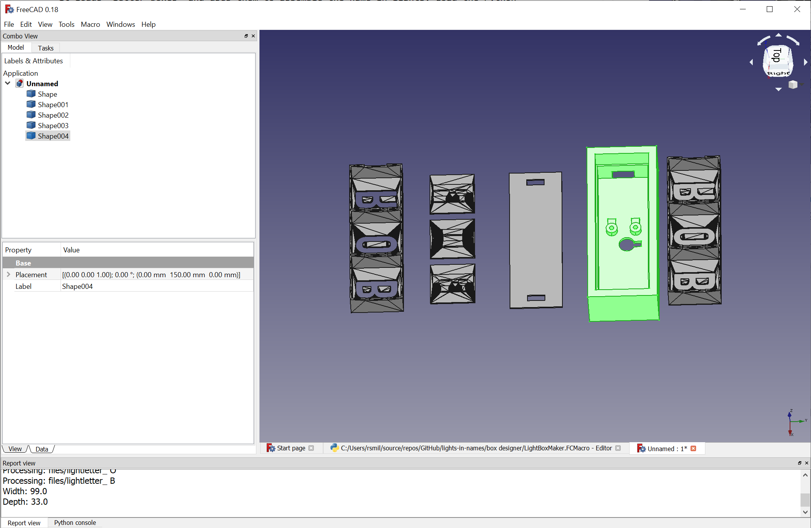
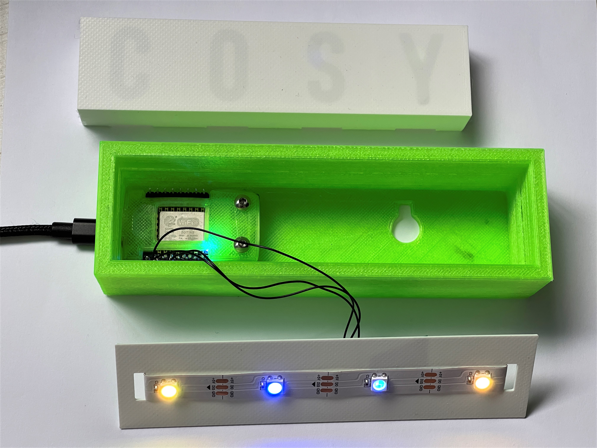

# Lights in Names

This page holds the design tool you can use to generate your own "Lights in Names" boxes. 

You will need:

* a Wemos D1 Mini device which fits inside the box to control it
* a strip of pixels to fit inside the box. You want IP30 (30 pixels per meter) WS2812B led strips. Get the ones without any covering. 
## Wiring

These are the connections you should make to your Wemos device.
## Box

The box designer is a Python macro that runs inside FreeCAD. You can download FreeCAD here: https://www.freecadweb.org/downloads.php The Python macro is in the "box designer" folder. It loads "letter boxes" and uses them to assemble the name in lights. Load the Python program as a macro and then make sure that the path to the letter box files is set correctly.

When you run the macro (which can take some time) it produces a set of designs for your light.

Click on the designs in model view and then export them to STL from the File menu. They are easy to print with no overhangs.

You can find the design for the Wemos holder in the file WemosHoder.stl

## Code

You can find the code to control the lights here: https://www.connectedlittleboxes.com/gettingstarted.html

Have fun

Rob Miles